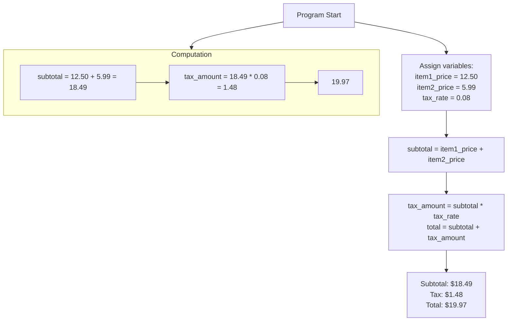

# Doing the Math: Arithmetic Operators in Python

> Performing Calculations in Your Code

- [Doing the Math: Arithmetic Operators in Python](#doing-the-math-arithmetic-operators-in-python)
  - [The Building Blocks of Computation](#the-building-blocks-of-computation)
  - [The Fundamental Operators](#the-fundamental-operators)
  - [Two Types of Division](#two-types-of-division)
  - [Power and In-Place Operations](#power-and-in-place-operations)
  - [The Order of Operations](#the-order-of-operations)
  - [Putting It All Together: A Shopping Cart](#putting-it-all-together-a-shopping-cart)
  - [Real-World Example](#real-world-example)
  - [Summary \& Best Practices](#summary--best-practices)
  - [Questions \& Practice](#questions--practice)

---

## The Building Blocks of Computation

- Arithmetic operators are symbols used to
perform mathematical operations between values
(called operands).
- They allow Python to function like a powerful
calculator, enabling dynamic calculations
within your programs.
- From calculating a total price to determining
the average of a set of numbers, they are
fundamental.

## The Fundamental Operators

The core four operations,
plus one more, work just as
you'd expect.

**Code example and Table:**

```python
a = 10
b = 3
print(a + b) # Addition -> 13
print(a - b) # Subtraction -> 7
print(a * b) # Multiplication -> 30
print(a / b) # Division -> 
```

| Operator | Name | Example | Result |
| ---- | --- | --- | --- |
| + | Addition | 10 + 3 | 13 |
| - | Subtraction | 10 - 3 | 7 |
| \* | Multiplication | 10 \* 3 | 30 |
| / |Division | 10 / 3 | 3.333... |
| % | Modulus | 10 % 3 | 1 |

## Two Types of Division

Python has two distinct division operators to handle
different needs.

1. **Floating-Point Division (/):**
       - The standard division operator.
       - Always returns a float result.
      - 10 / 2 returns 5.0, not 5.
2. **Integer (Floor) Division (//):**
      - Returns the quotient, discarding any remainder.
      - Rounds the result down to the nearest whole number.
      - 10 // 3 returns 3.

**Code Example:**

```python
print(10 / 3) # Output: 3.3333333333333335
print(10 // 3) # Output: 3
print(7 / 2) # Output: 3.5
print(7 // 2) # Output: 3
```

## Power and In-Place Operations

**Exponentiation (\*\*):**

- Raises the first number
to the power of the
second.
- 2 ** 3 means 2³, which
is 8.
- 5 ** 2 means 5², which
is 25.

**In-Place Operators (+=,
-=, \*=, etc.):**

- A shortcut for
performing an operation
on a variable and then
assigning the result
back to the same variable

**Code Example:**

```python
# Exponentiation
print(2 ** 4) # Output: 16
print(3 ** 2) # Output: 9

# In-Place Operators
count = 5
count += 2 # Same as: count =
count + 2
print(count) # Output: 7

total = 10
total *= 3 # Same as: total =
total * 3
print(total) # Output: 30
```

## The Order of Operations

- Python doesn't calculate from left to right; it follows a specific rule set called operator precedence.
- Remember the acronym **PEMDAS**:
  - Parentheses () Exponents ** Multiplication *, Division /, //, Modulus % Addition +, Subtraction -.

**Code Example:**

```python
result = 10 + 3 * 2 ** 2
# Step 1: 2 ** 2 = 4
# Step 2: 3 * 4 = 12
# Step 3: 10 + 12 = 22

print(result) # Output: 22

# Using parentheses to changethe order
result2 = (10 + 3) * 2 ** 2
# Step 1: (10 + 3) = 13
# Step 2: 2 ** 2 = 4
# Step 3: 13 * 4 = 52
print(result2) # Output: 52
```

## Putting It All Together: A Shopping Cart

A practical application using
multiple operators.

**Code Example:**

```python
# Prices of items
item1_price = 12.50
item2_price = 5.99
tax_rate = 0.08 # 8% tax

# Calculate subtotal
subtotal = item1_price + item2_price

# Calculate tax and total
tax_amount = subtotal * tax_rate
total = subtotal + tax_amount

print(f"Subtotal: ${subtotal:.2f}")
print(f"Tax: ${tax_amount:.2f}")
print(f"Total: ${total:.2f}")
```



**output**:

```txt
Subtotal: $18.49
Tax: $1.48
Total: $19.97
```

## Real-World Example

A great example using integer division (//) and modulus
(%) together.

**Code example:**

```python
total_seconds = 367

# Calculate minutes and seconds
minutes = total_seconds // 60 # How many whole minutes?
seconds = total_seconds % 60 # How many seconds are left over?

print(f"{total_seconds} seconds is {minutes} minutes and {seconds} seconds.")
```

**Output**:

```txt
367 seconds is 6 minutes and 7 seconds.
```

## Summary & Best Practices

- Arithmetic operators (+, -, *, /, %, \*\*, //) are used for mathematical calculations.
- Know the difference between / (float division) and // (integer division).
- Operator Precedence (PEMDAS) dictates the order of calculations.
- Use parentheses () to clarify complex expressions and force a specific order.
- In-place operators (+=) provide a concise way to update variables.
- The modulus operator % is extremely useful for determining even/odd numbers, cycles.

## Questions & Practice

Let's try a quick challenge!

Challenge: Write a short program that takes a
number of inches as input and converts it to
feet and inches.

*Hint: 1 foot = 12 inches. Use // and %.*

Thank you!
