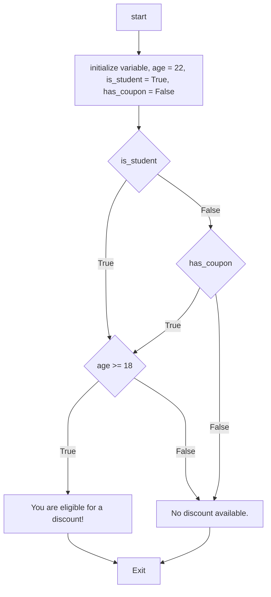
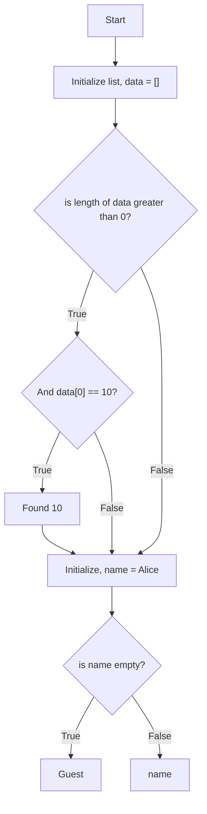
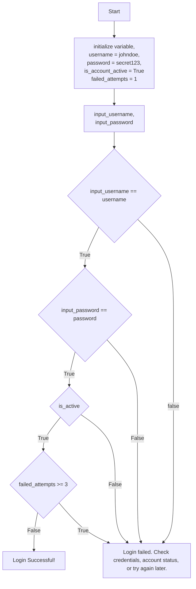

# Making Decisions Smarter: Logical Operators in Python

> Combining Conditions for Complex Logic

**Table of Contents:**

- [Making Decisions Smarter: Logical Operators in Python](#making-decisions-smarter-logical-operators-in-python)
  - [The World of True and False](#the-world-of-true-and-false)
  - [The and Operator: All Must Be True](#the-and-operator-all-must-be-true)
  - [The or Operator: At Least One Must Be True](#the-or-operator-at-least-one-must-be-true)
  - [The not Operator: The Reverser](#the-not-operator-the-reverser)
  - [Building Complex Logic](#building-complex-logic)
  - [Short-Circuit Evaluation](#short-circuit-evaluation)
  - [Real-World Example: Secure Login](#real-world-example-secure-login)
  - [Summary \& Best Practices](#summary--best-practices)

## The World of True and False

- Computers make decisions based on Boolean logic:
  - expressions that are either True or False.
- We've seen this in if statements:
  - **if condition.**
- Logical operators allow us to combine these **True/False** values to form more complex conditions.
- They are the **AND**, **OR**, and **NOT** of programming.

Analogy: "I will go to the park if it is sunny
**AND** I have free time."

## The and Operator: All Must Be True

- Returns True only if both operands (conditions) are True.
- If any condition is False, the entire expression is False.
- Think of it as: **"Are condition A and condition B both true?"**

**Code Example:**

```python
age = 25
has_license = True

if age >= 18 and has_license:
  print("You are allowed to drive.")
else:
  print("You cannot drive.")
# Output: You are allowed to drive.
```

## The or Operator: At Least One Must Be True

- Returns True if at least one operand (condition) is True.
- It only returns False if both conditions are False.
- Think of it as: **"Is condition A or condition B true?**"

**Code Example:**

```python
day = "Saturday"
is_holiday = False

if day == "Saturday" or day == "Sunday" or is_holiday:
  print("It's a day off!")
else:
  print("It's a weekday.")
# Output: It's a day off!
```

## The not Operator: The Reverser

- A unary operator (it works on a single condition).
- It reverses, or negates, the Boolean value.
- not True is False.
- not False is True.
- Think of it as: **"Is this condition not true?"**

**Code Example:**

```python
is_raining = False

if not is_raining:
  print("You don't need an umbrella.")
else:
  print("Take an umbrella!")
  # Output: You don't need an umbrella.

user_role = "guest"
if not user_role == "admin":
  print("Access denied.")
  # Checking if a user is NOT an admin
```

## Building Complex Logic

- You can combine **and,** **or**, and **not** to create sophisticated rules.
- Use parentheses () to group conditions and control the order of evaluation (just like in math!).

**Code Example:**

```python
age = 22
is_student = True
has_coupon = False

# Scenario: Discount for students OR anyone with a coupon, but they must be over 18.
if (is_student or has_coupon) and age >= 18:
  print("You are eligible for a discount!")
else:
  print("No discount available.")

# How it evaluates:
# 1. (True OR False) -> True
# 2. (True AND True) -> True
# Output: You are eligible for a discount!
```

how it works on flowchart for understanding:



## Short-Circuit Evaluation

- Python is smart! It stops evaluating a logical expression as soon as the final outcome is known.
- and: If the first condition is False, the result is already False. The second condition is not evaluated.
- or: If the first condition is True, the result is already True. The second condition is not evaluated.

Why it matters: It can improve performance and prevent errors.

**Code Example:**

```python
# Example 1: With 'and'
data = [] # An empty list

# if data is not empty AND the first element is 10
if len(data) > 0 and data[0] == 10:
  print("Found 10")
# This is safe! Because data is empty, the first condition (len(data)>0) is False.

# Python short-circuits and NEVER tries to evaluate data[0], which would cause an IndexError.

# Example 2: With 'or'
name = "Alice"

# If name is not empty OR we try to get a default value
greeting = name or "Guest"
print(greeting) # Output: Alice
```

**Flowchart version:**



---

## Real-World Example: Secure Login

A practical application combining all three operators for a security check.

**Code example**:

```python
# User credentials and status
username = "johndoe"
password = "secret123"
is_account_active = True
failed_attempts = 1

# Simulate login logic
input_username = "johndoe"
input_password = "secret123"

# Check if login is successful AND account is active AND not too many failed attempts
if (input_username == username and input_password == password) and is_account_active and not failed_attempts >= 3:
  print("Login successful! Welcome.")
else:
  print("Login failed. Check credentials, account status, or try again later.")
# Output: Login successful! Welcome.
```

**Flowchart**:



---

**for easy understanding Refer to the truth table:**

| A | B   | A OR B | A AND B | NOT A | NOT B |
|---- | ----- | ------ | ---- | ---- | --- |
| False | False | False  | False | True | True |
| False | True  | True   | False | True | False |
| True  | False | True   | False | False | True |
| True  | True  | True   | True  | False | False |

## Summary & Best Practices

- **and:** All conditions must be True.
- **or:** At least one condition must be True.
- **not:** Reverses a single Boolean value.
- Use parentheses () to group conditions and make complex logic clear.
- Remember short-circuiting! It can make your code faster and safer.
- When in doubt, refer to the truth tables.
